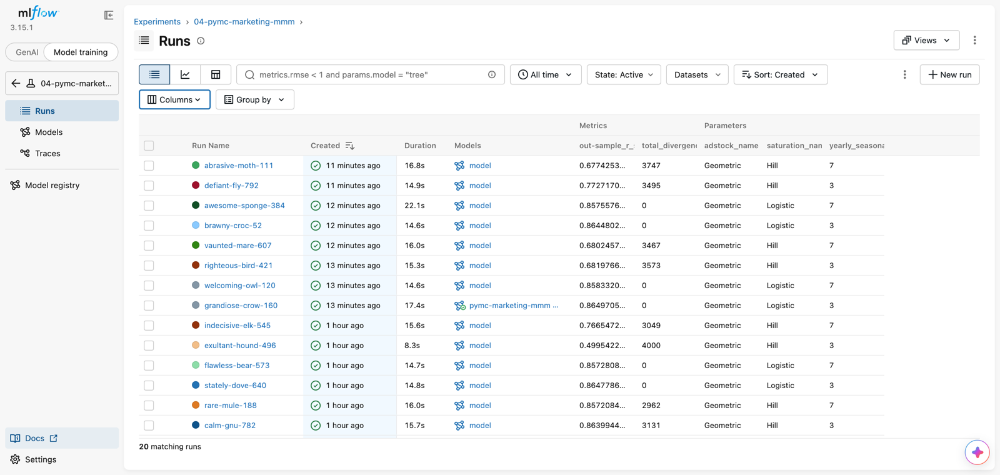
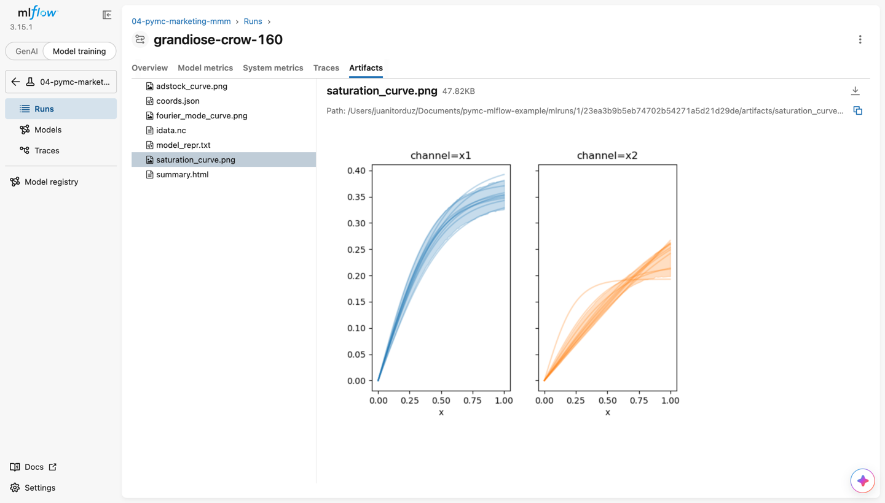

## PyMC-Marketing Marketing Mix Model MLflow Logging

The [`__main__.py`](__main__.py) script kicks off [various model
configurations](./run-config.yaml) and logs each as a separate run in MLflow.
The script leverages the `pymc_marketing.mlflow.autolog` function as well as
various `mlflow` log functions in order to customize the logging of the model.

The configurations use the `pymc-marketing>=1.0` serialization format: each
adstock / saturation entry carries a `__type__` key with the fully-qualified
class path, and is deserialized with `pymc_marketing.serialization`. A
different configuration file can be passed with `--config <path>`.

Below are a subset of the metrics & parameters
(screenshots from pymc-marketing 0.15; the exact autologged surface differs
slightly in 1.0):

And the artifacts that are saved off:

