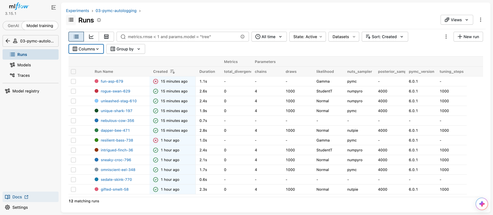

# PyMC with MLflow

These are simple examples of using PyMC with MLflow, taking advantage of the
`pymc_marketing.mlflow` module.

This focuses on logging parameters, metrics, and artifacts to MLflow.

The examples target `pymc-marketing>=1.0`, `pymc>=6`, `arviz>=1.2` (the new
ArviZ metapackage), and `mlflow>=3.15`. If you are migrating your own MMM code
from `pymc-marketing<1.0`, see the
[MMM migration guide](https://www.pymc-marketing.io/en/latest/notebooks/mmm/mmm_migration_guide.html).



*(screenshot from pymc-marketing 0.15; the exact autologged surface differs slightly in 1.0)*

Suggestions or Questions? [Comment on this Issue](https://github.com/pymc-labs/pymc-marketing/issues/938)

## Scripts

There are four scripts:

1. [Non-PyMC example showing how to log parameters, metrics, and artifacts to MLflow](./01-basic-introduction.py)
2. [PyMC example which logs some PyMC related metrics to MLflow](./02-pymc-context.py)
3. [Logging that and more with `pymc_marketing.mlflow` module](./03-pymc-autologging.py)
4. [Autologging of Marketing Mix Model with `pymc_marketing.mlflow` module](./04-pymc-marketing-mmm)

Kick them off with `make experiments`. View with `make serve`. Clean up with `make clean_up`.

There are some helper functions in the `utils.py` file which help setup mlflow and define some reused PyMC models.

## Environment (pixi)

The project is managed with [pixi](https://pixi.sh); the dependencies and the
multi-platform lockfile (`pixi.lock`, covering `osx-arm64`, `linux-64`, and
`osx-64`) live in `pyproject.toml`.

```bash
# install pixi once (see https://pixi.sh/latest/#installation)
curl -fsSL https://pixi.sh/install.sh | sh

# create the environment from the committed lockfile
pixi install
```

All `make` targets wrap their commands with `pixi run`, so there is no need to
activate anything — but they must be run **from the repository root**, since
the MLflow tracking database and artifact paths are relative.

## MLflow server

### Spin it up

```bash
make serve
```

This runs:

```bash
mlflow server --backend-store-uri sqlite:///mlruns.db --default-artifact-root ./mlruns
```

- The UI is served at <http://127.0.0.1:5000>. The server binds to localhost
  only; add `--host 0.0.0.0 --port <port>` to expose it beyond your machine.
- `mlruns.db` is a SQLite database acting as the tracking backend — the same
  file the example scripts write to directly (see `mlflow_set_tracking_uri`
  in [utils.py](./utils.py)), so you can run the experiments first and browse
  them afterwards.
- Artifacts (figures, inference data, models) are stored on the local
  filesystem at the location recorded when each experiment is created.

### Prune it (sandbox workflow)

Deleting runs in the UI (or with `mlflow experiments delete`) only
*soft-deletes* them — the rows and artifacts stay on disk. To reclaim space in
a throwaway/sandbox setup:

```bash
# 1. stop the server first: SQLite allows a single writer, and running gc
#    against a live server can fail with "database is locked"
# 2. hard-delete everything that was soft-deleted
make prune
```

`make prune` runs
`mlflow gc --tracking-uri sqlite:///mlruns.db --backend-store-uri sqlite:///mlruns.db`.
Useful variations (run them with `pixi run mlflow gc ...`):

- `--older-than 7d` — only garbage-collect runs deleted more than 7 days ago
- `--experiment-ids 1,2` — restrict to specific experiments
- `--run-ids <id>,<id>` — restrict to specific runs

For a complete reset of the sandbox (tracking database **and** all artifacts):

```bash
make clean_up   # rm -rf mlruns mlruns.db
```

## Resources

- [`pymc_marketing.mlflow` module](https://www.pymc-marketing.io/en/latest/api/generated/pymc_marketing.mlflow.html)
- [MLflow Documentation](https://www.mlflow.org/docs/latest/index.html)
- [MLflow Tracking Server](https://mlflow.org/docs/latest/tracking/server.html)
